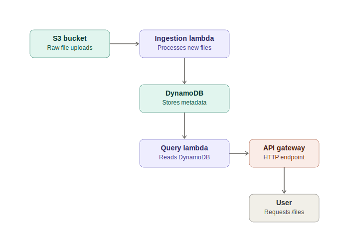

# aws-serverless-data-pipeline
# Serverless Data Ingestion & Query Pipeline

> Status: ✅ Complete

## Overview
This project is a serverless data ingestion and query pipeline built on AWS, deployed entirely through Infrastructure as Code with an automated CI/CD pipeline.

Files uploaded to S3 automatically trigger a Lambda function that processes and stores structured metadata in DynamoDB. A second Lambda function, exposed through an API Gateway HTTP endpoint, allows that data to be queried on demand. The entire stack — S3, Lambda, DynamoDB, API Gateway, and all IAM roles — is defined as a single CloudFormation template and deployed automatically via GitHub Actions on every push to `main`. CloudWatch alarms monitor the pipeline for runtime errors, separate from a billing alarm that protects against unexpected cost.

Beyond the working pipeline, this project doubles as a hands-on exploration of AWS least-privilege IAM practices, cost-conscious serverless architecture, Infrastructure as Code, and CI/CD — including real permission failures encountered and resolved along the way (documented milestone by milestone in [`/docs`](./docs)).

## Architecture


**Ingestion path:** A file uploaded to S3 triggers the ingestion Lambda, which writes a processed record to DynamoDB.
**Query path:** A user's request to the API Gateway endpoint invokes the query Lambda, which reads from DynamoDB and returns JSON.

The entire stack is defined as Infrastructure as Code ('infrastructure/template.yaml') and deployed automatically via a GitHub Actions CI/CD pipeline on every push to `main`.

## AWS Services Used
| Service | Purpose |
|---|---|
| IAM | Non-root user + group for daily console/CLI access, MFA-protected |
| CloudWatch | Billing alarm — monitors estimated account charges |
| SNS | Delivers billing alarm notification via email |
| S3 | Stores raw data files uploaded to the pipeline; triggers Lambda on new uploads |
| IAM Role (lambda-s3-read-role) | Grants Lambda least-privilege permissions to read from S3 and write logs to CloudWatch |
| Lambda | Runs code automatically in response to events (S3 uploads, API requests); two functions: one ingests, one queries |
| DynamoDB | Stores processed file metadata (file_id, bucket, status) for later querying |
| IAM Role (lambda-dynamodb-read-role) | Grants query Lambda least-privilege permissions to read from DynamoDB and write logs to CloudWatch |
| API Gateway (HTTP API) | Exposes a public GET endpoint that queries processed file data |
| CloudFormation | Defines all project resources as a single Infrastructure-as-Code template; enables one-click deploy and teardown |
| GitHub Actions | Automates CloudFormation deployment on push to main (CI/CD) |
| CloudWatch (Alarms + Dashboard) | Monitors pipeline health — alerts on Lambda errors, visualizes invocation/error/duration metrics |


## Cost Breakdown
Every resource in this project stays within AWS's free tier. Full per-resource breakdown → [`docs/cost-breakdown.md`](./docs/cost-breakdown.md)

| Category | Services | Monthly Cost |
|---|---|---|
| Account safety | IAM, CloudWatch billing alarm, SNS | $0 |
| Ingestion | S3, IAM role, Lambda, S3 event notification | $0 |
| Storage & query | DynamoDB, Lambda, API Gateway | $0 now; API Gateway becomes billable after 12 months |
| IaC & CI/CD | CloudFormation, GitHub Actions, IAM deploy user | $0 |
| Monitoring | CloudWatch alarms/dashboard, SNS | $0 |

## Setup / Deployment Guide

### Prerequisites
- An AWS account
- AWS CLI installed and configured (`aws configure`) with credentials for an IAM user with sufficient permissions to create S3, DynamoDB, Lambda, IAM, and API Gateway resources
- Git installed

### Option A: Manual deploy via AWS CLI
1. Clone this repository:
```bash
git clone https://github.com/Kashvi09/aws-serverless-data-pipeline.git
cd aws-serverless-data-pipeline
```

2. Deploy the CloudFormation stack:

```bash
aws cloudformation deploy \
  --template-file infrastructure/template.yaml \
  --stack-name serverless-pipeline-stack \
  --capabilities CAPABILITY_NAMED_IAM
```

3. Once complete, retrieve the API endpoint:

```bash
aws cloudformation describe-stacks \
  --stack-name serverless-pipeline-stack \
  --query "Stacks[0].Outputs[0].OutputValue" \
  --output text
```

### Option B: Automated deploy via CI/CD (GitHub Actions)
1. Fork or clone this repository.
2. Create an IAM user in your own AWS account with programmatic access and permissions covering CloudFormation, S3, DynamoDB, Lambda, IAM, and API Gateway.
3. In your forked repo, go to **Settings → Secrets and variables → Actions**, and add:
   - `AWS_ACCESS_KEY_ID`
   - `AWS_SECRET_ACCESS_KEY`
4. Push any change to `infrastructure/template.yaml` on the `main` branch — this automatically triggers `.github/workflows/deploy.yml`, which deploys the stack to your AWS account.

### Testing the pipeline
1. Upload a test file to the S3 bucket created by the stack.
2. Check the DynamoDB table (`ProcessedFilesMetadata`) — a new item should appear with the file's key.
3. Call the API endpoint (from the CloudFormation Outputs) at the `/files` route to confirm it returns the stored records as JSON.

### Cleanup / Cost avoidance
To tear down every resource this project creates in one step:
aws cloudformation delete-stack --stack-name serverless-pipeline-stack

Note: the S3 bucket must be empty before deletion succeeds — empty it manually first if it contains test files.

## Milestone Log

Detailed write-ups (why each decision was made, what was built, lessons learned) live in [`/docs`](./docs):

- [Milestone 1: Account Safety Net](./docs/milestone-1-account-setup.md)
- [Milestone 2: S3 Ingestion Bucket + IAM Role](./docs/milestone-2-s3-iam.md)
- [Milestone 3: Lambda Function + S3 Event Trigger](./docs/milestone-3-lambda-trigger.md)
- [Milestone 4: DynamoDB Table for Processed Data](./docs/milestone-4-dynamodb-table.md)
- [Milestone 5: API Gateway Query Endpoint](./docs/milestone-5-httpapi-setup.md)
- [Milestone 6: Infrastructure As code](./docs/milestone-6-infrasturcture-as-code.md)
- [Milestone 7: CI/CD Pipeline (Github Actions)](./docs/milestone-7-github-actions.md)
- [Milestone 8: CloudWatch Dashboards + SNS Alerting](./docs/milestone-8-sns-alerting.md)

## Known Limitations
- The `/files` API Gateway endpoint is currently open — no authentication or API key required. Anyone with the URL can query it.
- The GitHub Actions deploy user (`github-actions-deployer`) currently has broad managed policies (Full Access across S3, DynamoDB, Lambda, API Gateway, IAM) rather than resource-scoped custom policies — a deliberate simplification, same pattern as earlier milestones.


## Future Improvements
- Add an API Gateway authorizer (API Key or Lambda authorizer) to restrict access to the query endpoint.
- Scope `github-actions-deployer`'s permissions down to exact resource ARNs, matching the least-privilege approach already applied to the Lambda execution roles in Milestone 6.
- Add a CloudWatch alarm on the query Lambda's Errors metric, and a separate alarm on API Gateway's 5xx metric — monitoring at both the Lambda layer and the API layer catches different failure classes (e.g., integration timeouts that wouldn't necessarily show up as a Lambda-level error).

## Interview Questions & Answers
A compiled set of technical Q&A covering IAM, DynamoDB, API Gateway, IaC, and CI/CD decisions made throughout this project → [`docs/interview-questions.md`](./docs/interview-questions.md)