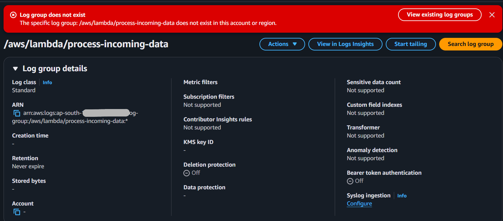
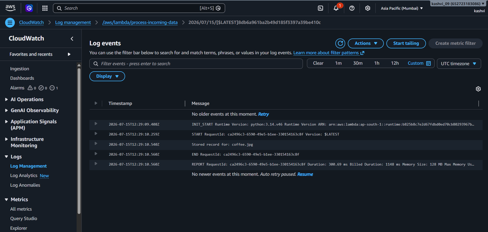
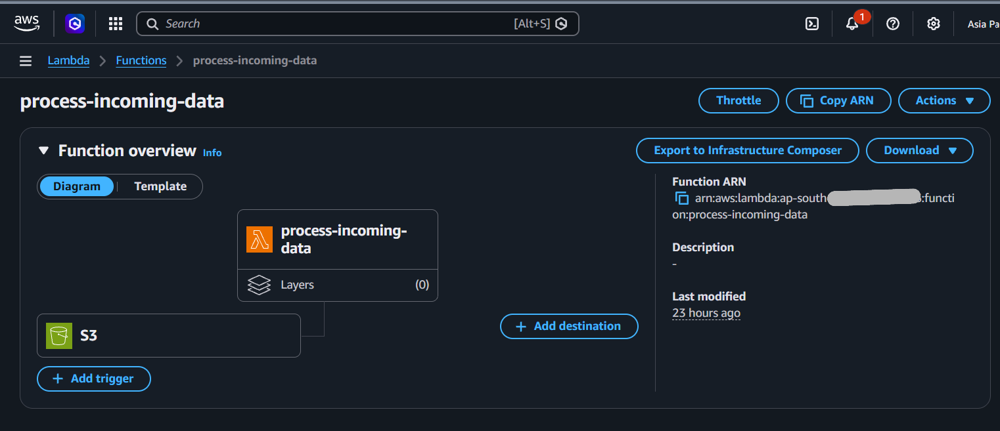

# Milestone 3: Lambda Function + S3 Event Trigger
**Why:** This milestone makes the pipeline actually event-driven — instead of running a server continuously to check for new data, we configure S3 to automatically invoke a Lambda function the moment a file is uploaded. S3 is given permission to invoke Lambda, so as soon as an object is created in the bucket, Lambda spins up, runs its code against that specific file, and shuts down. This means zero cost and zero running infrastructure when no files are being uploaded — the system only "wakes up" in reaction to real events.

**What was built:**
- Lambda function: process-ingested-data (Python 3.12 runtime), using the execution role lambda-s3-read-role from Milestone 2.
- S3 Event Notification: configured on kashvi-pipeline-raw-data to trigger the Lambda function on all object-create events.
- The function currently reads the bucket name and object key from the event payload and logs them — proving the trigger chain works end-to-end, before we add real processing logic later.

**Lessons Learned**
- When AWS auto-generates a Lambda execution role through the console, it attaches AWSLambdaBasicExecutionRole by default, which grants permission to write to CloudWatch Logs. Because we manually attached our own role (lambda-s3-read-role, scoped only to S3 read access) instead, logging permission wasn't included — so the function ran and triggered correctly, but silently failed to write any log output.
- This showed that logging in Lambda isn't automatic — like everything else in AWS IAM, it requires an explicit permission (logs:CreateLogGroup, logs:CreateLogStream, logs:PutLogEvents). Fixed by attaching AWSLambdaBasicExecutionRole to the existing role — no code redeploy needed, since IAM permission changes apply immediately.
- This also clarified that there are two separate "permission directions" at play: the execution role controls what the Lambda function itself is allowed to do (read S3, write logs), while a separate resource-based policy controls who is allowed to invoke the Lambda function in the first place (in this case, granting S3 that right).

**Screenshots**

