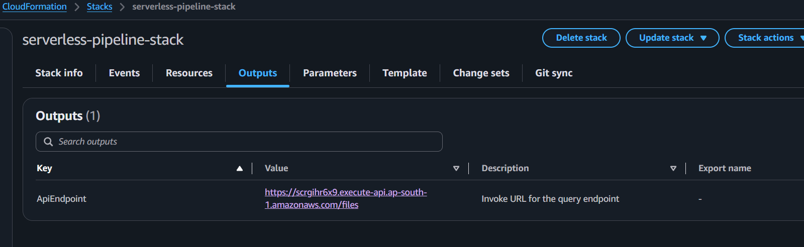
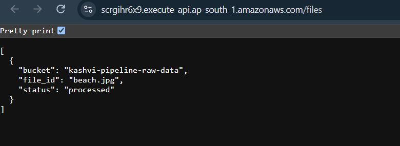
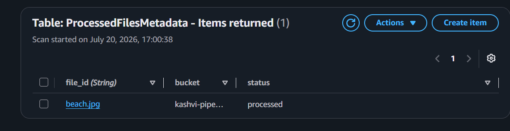

# Milestone 6:  Infrastructure As Code
**Why:** Building infrastructure manually through the console is error-prone in two specific ways: it's easy to misconfigure a resource without noticing, and when tearing a project down, it's easy to accidentally skip a resource — leaving it running and incurring cost indefinitely. CloudFormation solves both: the entire environment is defined once as code, deployed consistently every time, and can be torn down completely with a single "Delete Stack" action, guaranteeing nothing is left behind.

**What was built:**
- A single template (infrastructure/template.yaml) defining every resource in the project: the S3 bucket, DynamoDB table, both Lambda functions, both IAM roles, the S3 event trigger, and the API Gateway HTTP API.
- This milestone also resolved the least-privilege compromises flagged since Milestone 2 and Milestone 4 — the broad managed policies (AmazonS3ReadOnlyAccess, AmazonDynamoDBFullAccess) were replaced with custom policies scoped to exact resource ARNs (the specific bucket, the specific table, the specific log groups per function)..

**Lessons Learned**
- !GetAtt and !Sub are CloudFormation's intrinsic functions for avoiding hardcoded values: !GetAtt fetches a specific attribute (like an ARN) from a resource once CloudFormation creates it, while !Sub substitutes variables into a string. Using these instead of hardcoding ARNs or account IDs means the template stays portable — it would work correctly if redeployed to a different AWS account or region without any manual edits.
- DependsOn was needed between the S3 bucket and the Lambda invoke permission, because CloudFormation couldn't automatically infer the correct creation order between them — the bucket's event notification needed the Lambda permission to exist first, so this was stated explicitly rather than relying on automatic dependency detection.
- Actually resolving the least-privilege compromise (rather than just re-flagging it) required rewriting IAM policies with exact resource ARNs — a good demonstration that "known limitations" should have a real endpoint, not just remain a permanent caveat in the docs.
- CloudFormation deletes resources in reverse dependency order, not simply the reverse of how they're written in the template — a resource can only be deleted once everything depending on it is already gone (e.g., IAM roles are deleted last, since Lambda functions reference them).
- A non-empty S3 bucket will cause stack deletion to fail (`DELETE_FAILED`) — CloudFormation won't force-delete a bucket with objects still in it, same restriction as the console.
- Hand-writing scoped ARNs works at this project's small scale, but doesn't scale to real-world projects with dozens of resources. Tools like AWS IAM Access Analyzer (generates least-privilege policies from actual CloudTrail usage) and AWS CDK (higher-level IaC with built-in scoped-permission helpers like `grantReadData()`) exist specifically to solve this at scale.

**Screenshots**

.png)
.png)

