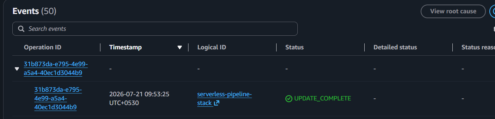
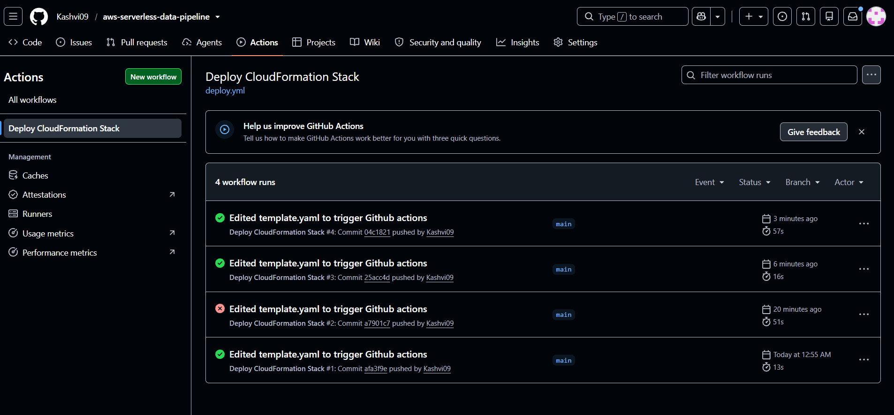

# Milestone 7:  CI/CD Pipeline (Github Actions)
**Why:** Manually uploading the CloudFormation template through the console every time it changes is fine for a solo project, but doesn't scale — teams need every change automatically deployed and auditable, without a manual step someone could forget or get wrong. GitHub Actions automates this: pushing a change to main that touches infrastructure/template.yaml automatically triggers a deploy to AWS, with no console interaction needed. The workflow is scoped to that specific file path so that unrelated changes (docs, README updates) don't trigger unnecessary redeploys.

**What was built:**
- rkflow file: .github/workflows/deploy.yml, triggered on pushes to main that modify infrastructure/template.yaml.
- New IAM user: github-actions-deployer, created with programmatic access only (no console login), used exclusively by the workflow to authenticate with AWS.
- The workflow checks out the repo, configures AWS credentials from GitHub-encrypted secrets, then runs aws cloudformation deploy to update the existing stack.

**Lessons Learned**
- Hit a real AccessDenied failure on RawDataBucket after adding a tag to test the pipeline. The cause: AWSCloudFormationFullAccess only grants permission to orchestrate CloudFormation deployments — it doesn't grant permission to perform the actual underlying service actions (like modifying an S3 bucket). CloudFormation executes changes using the deploying user's own permissions, so github-actions-deployer also needed direct S3/DynamoDB/Lambda/API Gateway/IAM permissions attached, not just the CloudFormation-level policy.
- Creating IAM roles (as this template does) also required iam:PassRole permission — a deliberately sensitive permission in AWS, since letting a user "pass" a role to a service is a known vector for privilege escalation if scoped too broadly. Using IAMFullAccess here is a training-wheels compromise, flagged for future scoping.
- 'aws cloudformation deploy' correctly reports "No changes to deploy" when a pushed template is identical to what's already live — confirmed this is expected, idempotent behavior, not a failure, after initially mistaking it for the pipeline not working.

**Screenshots**

